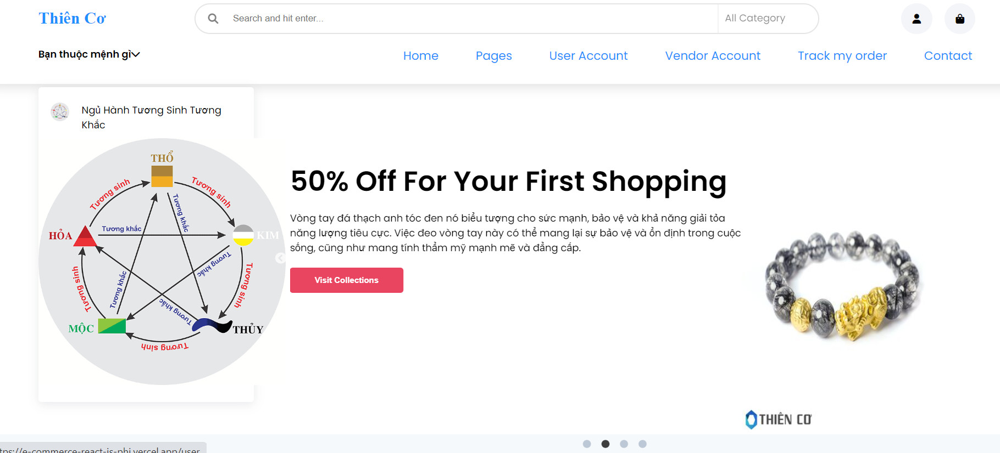

# E-commerce_ReactJS

## Introduction

The E-commerce ReactJS project is a web application built with ReactJS, allowing users to view and purchase products in an online store. This project is developed to implement basic functionalities of an e-commerce website, including displaying product listings, adding to cart, payment, and order management.

# Installation

1. Clone this repository to your computer: https://github.com/duylinh13/E-commerce_ReactJS.git

2. Navigate to the project directory: cd e-commerce-reactjs

3. Install the necessary dependencies: npm install

4. Start the application: npm start

5. Open your browser and visit http://localhost:3000 to view the project.

**View Products**: Access the homepage to view the list of available products.
**Add to Cart**: Click the "Add to Cart" button to add a product to your shopping cart.

# Contribution

If you would like to contribute to the project, please create a pull request and we will review it. You can also report bugs or submit suggestions by opening an issue on GitHub.

# Author

Github: https://github.com/duylinh13
Gmail: huynhleduylinh1311@gmail.com

---

# E-commerce_ReactJS

## Giới thiệu

Dự án E-commerce ReactJS là một ứng dụng web được xây dựng bằng ReactJS, cho phép người dùng xem và mua các sản phẩm trong một cửa hàng trực tuyến. Dự án này được phát triển để thực hiện các chức năng cơ bản của một trang web mua sắm trực tuyến, bao gồm hiển thị danh sách sản phẩm, thêm vào giỏ hàng, thanh toán và quản lý đơn hàng.

## Cài đặt

1. Clone repository này về máy tính của bạn:https://github.com/duylinh13/E-commerce_ReactJS.git

2. Di chuyển vào thư mục của dự án: cd e-commerce-reactjs

3. Cài đặt các dependencies cần thiết:npm install

4. Khởi động ứng dụng: npm start

5. Mở trình duyệt và truy cập địa chỉ [http://localhost:3000](http://localhost:3000) để xem dự án.

- **Xem sản phẩm**: Truy cập vào trang chủ để xem danh sách các sản phẩm có sẵn.
- **Thêm vào giỏ hàng**: Bấm vào nút "Thêm vào giỏ hàng" để thêm sản phẩm vào giỏ hàng của bạn.

## Đóng góp

Nếu bạn muốn đóng góp vào dự án, hãy tạo pull request và chúng tôi sẽ xem xét nó. Bạn cũng có thể báo cáo lỗi hoặc gửi đề xuất bằng cách mở một issue trên GitHub.

## Tác giả

- Github: https://github.com/duylinh13

- Gmail: huynhleduylinh1311@gmail.com
